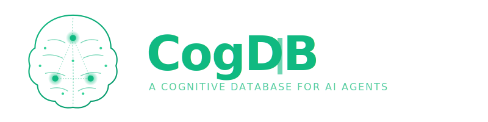
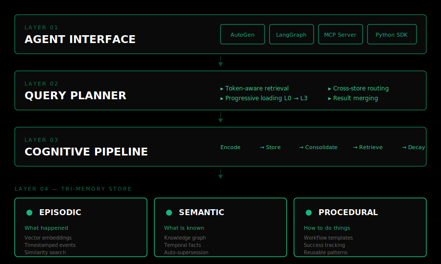

<div align="center">



<br/>

[](https://opensource.org/licenses/MIT)
[](https://www.python.org/downloads/)
[](#roadmap)
[](#contributing)

**A second brain for AI agents — episodic, semantic, and procedural memory in one engine.**

[Quick Start](#-quick-start) · [Architecture](#-architecture) · [Why CogDB](#-why-cogdb) · [Roadmap](./BACKLOG.md) · [Research](./docs/research.md)

</div>

---

## 🧠 The Problem

Every AI agent framework treats memory as someone else's problem.

You bolt on a vector database. Then a graph DB for relationships. Then SQLite for structured stuff. Now you're maintaining three backends that don't talk to each other. When two agents update the same fact at the same time, things break silently.

CogDB is a single database that gives AI agents a complete memory system. One install, one interface, one data store.

## 🌱 What CogDB Does Differently

CogDB unifies the three types of memory that map to how human cognition actually works:

<table>
<tr>
<td width="33%" valign="top">

### 🟢 Episodic
**What happened**

Timestamped records of agent interactions, observations, and tool calls. Stored as vector embeddings with full metadata. Agents search by similarity — *"find me situations like this one."*

</td>
<td width="33%" valign="top">

### 🟢 Semantic
**What is known**

A temporal knowledge graph where facts have lifecycles. Facts get superseded automatically when newer ones contradict them. Confidence scores, validity windows, provenance links.

</td>
<td width="33%" valign="top">

### 🟢 Procedural
**How to do things**

Learned workflows captured from successful agent task completions. Reusable templates with success tracking. **This memory type basically doesn't exist in any other system.**

</td>
</tr>
</table>

## ⚡ Why CogDB

| Capability | Mem0 | Zep | Letta | MemPalace | **CogDB** |
|---|:---:|:---:|:---:|:---:|:---:|
| Episodic memory | ✓ | ✓ | ✓ | ✓ | ✓ |
| Semantic / knowledge graph | ✓ | ✓ | ✓ | ✓ | ✓ |
| Procedural memory | ⚠️ | ✗ | ⚠️ | ✗ | **✓** |
| Token-aware retrieval | ✗ | ✗ | ✗ | ⚠️ | **✓** |
| Multi-agent memory scopes | scoped | per-user | shared | per-agent | **4 formal scopes** |
| Single unified engine | ✗ | ✗ | ✗ | ✗ | **✓** |
| MCP server | ✗ | ✗ | ✗ | ✓ | **✓** |
| AutoGen + LangGraph adapters | partial | ✗ | ✗ | ✗ | **✓** |

## 🏗 Architecture

<div align="center">



</div>

Four layers, one engine:

- **Layer 1 — Agent Interface.** Drop-in adapters for AutoGen and LangGraph. MCP server so any MCP-compatible agent can connect. Native Python SDK.
- **Layer 2 — Query Planner.** Token-aware retrieval routes queries across stores and packs results into the budget you set. Highest importance first, nothing wasted.
- **Layer 3 — Cognitive Pipeline.** Encoding, storage, consolidation, retrieval, and decay. Memories don't just sit there — they evolve.
- **Layer 4 — Tri-Memory Store.** Episodic (vector embeddings), semantic (temporal knowledge graph), procedural (workflow templates). Three stores, one query interface.

## 🚀 Quick Start

```bash
pip install git+https://github.com/MuLIAICHI/cogdb.git
```

```python
from cogdb import CognitiveDB

db = CognitiveDB(db_path="./agent_memory")

# 🟢 Store an episodic memory
db.remember(
    "Deployed v2.3 to production. CORS error on /users endpoint.",
    agent_id="devops-agent",
    importance=0.9,
)

# 🟢 Store a semantic fact (gets superseded automatically when contradicted)
db.learn(
    subject="api_service",
    predicate="version",
    object="v2.3",
    agent_id="devops-agent",
    confidence=1.0,
)

# 🟢 Store a procedural workflow
db.learn_procedure(
    name="fix_cors_error",
    steps=[
        {"action": "check_nginx_config", "tool": "cat /etc/nginx/conf.d/api.conf"},
        {"action": "add_cors_headers", "tool": "sed"},
        {"action": "reload_nginx", "tool": "systemctl reload nginx"},
        {"action": "verify", "tool": "curl -I"},
    ],
    agent_id="devops-agent",
    applicable_contexts=["cors", "nginx", "api"],
)

# 🟢 Recall with a token budget
memories = db.recall(
    "How do we fix CORS errors?",
    agent_id="devops-agent",
    token_budget=500,
)

# 🟢 Get progressive context (L0 → L3)
context = db.get_context(
    agent_id="devops-agent",
    level=2,
    task_hint="API gateway returning 403 on preflight",
    token_budget=800,
)
```

## 🔌 Integrations

<table>
<tr>
<td width="33%" valign="top">

### 🟢 AutoGen

```python
from cogdb.adapters.autogen import CogDBMemory
from autogen_agentchat.agents import AssistantAgent

memory = CogDBMemory(db_path="./memory")
agent = AssistantAgent(
    name="assistant",
    memory=[memory],
)
```

Drop-in replacement for AutoGen's basic `ListMemory`.

</td>
<td width="33%" valign="top">

### 🟢 LangGraph

```python
from cogdb.adapters.langgraph import (
    CogDBCheckpointer,
    CogDBStore,
)

graph = StateGraph(State).compile(
    checkpointer=CogDBCheckpointer(...),
    store=CogDBStore(...),
)
```

Native `BaseCheckpointSaver` and `BaseStore` implementations.

</td>
<td width="33%" valign="top">

### 🟢 MCP Server

```bash
cogdb-mcp --db-path ./memory
```

Exposes 6 tools — `remember`, `recall`, `learn`, `learn_procedure`, `get_context`, `forget` — to any MCP-compatible agent (Claude Code, Cursor, Windsurf).

</td>
</tr>
</table>

## 📊 Token-Aware Retrieval

This is the part that took the most iteration. Most memory systems dump a wall of context into the LLM and hope for the best. CogDB does it in tiers:

```
┌─ Token Budget: 500 ──────────────────────────────────┐
│                                                       │
│  L0  Identity              ~50 tokens     [filled]    │
│  L1  Critical facts       ~200 tokens     [filled]    │
│  L2  Task-relevant        ~250 tokens     [filled]    │
│  L3  Deep search             0 tokens     [skipped]   │
│                                                       │
└───────────────────────────────────────────────────────┘
```

Set a budget, CogDB fills it from the top with the highest-importance memories that fit. The agent gets exactly what it needs and nothing it doesn't — which means faster responses, lower API costs, and no context window blowouts.

## 👥 Multi-Agent Memory Scopes

When you have multiple agents working together, they need different levels of memory access. CogDB has four formal scopes with consistency guarantees:

```
┌─────────────────────────────────────────────┐
│  🟢 Organization      All agents read       │
│  ┌─────────────────────────────────────┐    │
│  │  🟢 Team        Group read-write    │    │
│  │  ┌─────────────────────────────┐    │    │
│  │  │  🟢 Private   Single agent  │    │    │
│  │  └─────────────────────────────┘    │    │
│  └─────────────────────────────────────┘    │
└─────────────────────────────────────────────┘
┌─────────────────────────────────────────────┐
│  🟢 Session  Ephemeral, auto-deleted        │
└─────────────────────────────────────────────┘
```

Contradiction detection runs at write time. Conflict resolution handles concurrent writes. No silent data loss when agents collaborate.

## 🗺 Roadmap

CogDB is in **Phase 0** — a Python proof-of-concept that proves the core ideas work.

- ✅ **Phase 0 — Python PoC.** Tri-memory engine, adapters, MCP server. *(Current)*
- 🚧 **Phase 0.5 — Validation.** Production dogfooding via [CogBoard](https://github.com/MuLIAICHI/cogboard), benchmarks vs Mem0/Zep/MemPalace.
- 📋 **Phase 1 — Rust Engine.** Purpose-built storage with hybrid indexes (HNSW + B+Tree + adjacency lists), WAL, crash recovery.
- 📋 **Phase 2 — Self-Improving.** Internal ML models for retrieval optimization, consolidation, access prediction, importance scoring.
- 💭 **Phase 3 — Agent-Native Evolution.** Agents define and evolve schemas through interaction.
- 💭 **Phase 4 — Predictive Memory.** Consequence prediction inspired by LeCun's JEPA — agents simulate outcomes before acting.

Full roadmap with status tracking → [BACKLOG.md](./BACKLOG.md)

## 📚 Research

CogDB is grounded in academic research on cognitive architectures, learned database systems, and multi-agent memory:

- **CoALA** (Sumers, Yao et al., 2024) — Cognitive Architectures for Language Agents
- **JEPA** (LeCun, 2022) — A Path Towards Autonomous Machine Intelligence
- **Learned Index Structures** (Kraska et al., 2018) — Neural networks replacing B-Trees
- **Multi-Agent Memory Architecture** (UCSD, 2026) — Cache coherence for agent memory

Full landscape analysis covering 15+ existing systems → [docs/research.md](./docs/research.md)

## 🤝 Contributing

CogDB is in early development and contributions are welcome across:

- **Framework adapters** — CrewAI, OpenAI Agents SDK, Semantic Kernel
- **Benchmarks** — LongMemEval, multi-agent consistency tests
- **Core engine** — Memory consolidation, importance scoring, retrieval
- **Research** — New memory system analyses, academic paper reviews

See [CONTRIBUTING.md](./CONTRIBUTING.md) to get started.

## 📄 License

MIT — see [LICENSE](./LICENSE).

## 📖 Citation

If you use CogDB in research or production:

```bibtex
@software{cogdb2026,
  title  = {CogDB: A Cognitive Database for AI Agents},
  author = {Mustapha Liaichi},
  year   = {2026},
  url    = {https://github.com/MuLIAICHI/cogdb}
}
```

---

<div align="center">

**Built by [Mustapha Liaichi](https://github.com/MuLIAICHI)** · [AYAutomate](https://ayautomate.com)

<sub>If CogDB saves you from stitching together three databases, ⭐ the repo.</sub>

</div>